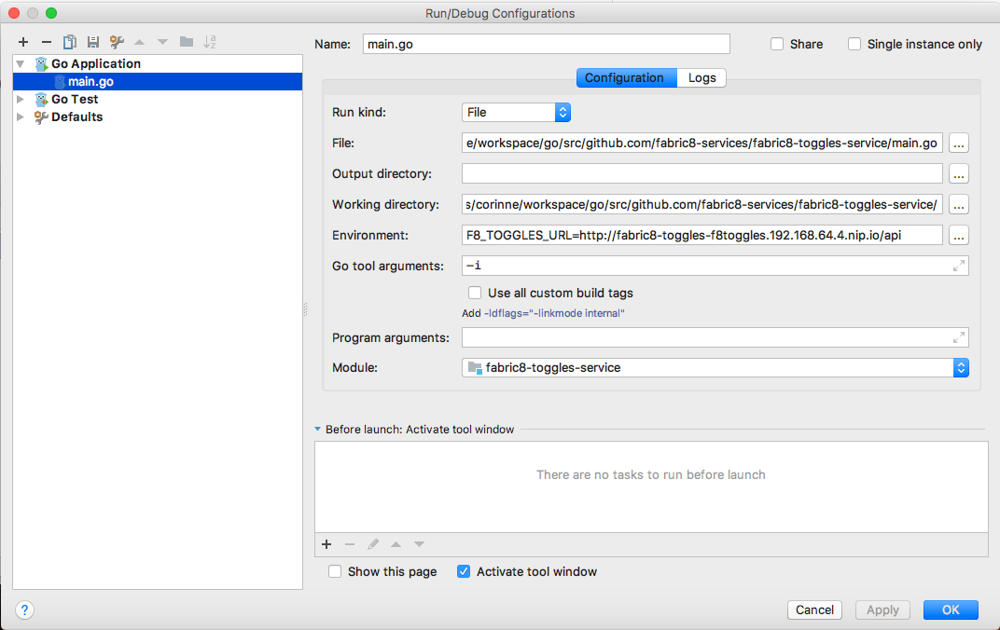
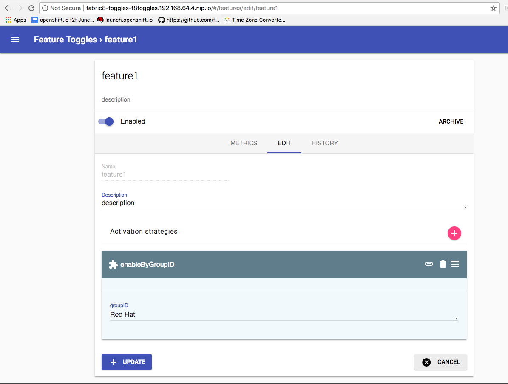

= Fabric8 toggles service

// Settings:
:allow-uri-read:
:safe: unsafe
:idprefix:
:idseparator: -
ifndef::env-github[:icons: font]
ifdef::env-github,env-browser[]
:toc: macro
:toclevels: 1
endif::[]
ifdef::env-github[]
:branch: master
:status:
:outfilesuffix: .adoc
:!toc-title:
:caution-caption: :fire:
:important-caption: :exclamation:
:note-caption: :paperclip:
:tip-caption: :bulb:
:warning-caption: :warning:
endif::[]

toc::[]

== Overview

The fabric8-toggles-service is the client service to run with the link:https://github.com/fabric8-services/fabric8-toggles/[fabric8-toggles] server.
The server is heavily based on link:https://github.com/Unleash/unleash[Unleash server], a *feature toggle system*, that gives you a great overview over all feature toggles across all your applications and services.
It comes with official client implementations for Java, Node.js and Go.

fabric8-server defines 4 level of toggle configuration: `internal`, `experimental`, `beta` or `released`.
The activation strategy is per userGroupId.

Using the admin console deployed with fabric8-toggle, you can easily
move a feature from `experimental` to `beta`.
This client makes use of the unleash Go SDK to connect to fabric8-toggles server.

You can see usage of the service in link:https://github.com/fabric8-ui/fabric8-ui[fabric8-ui].

== Development

=== Build

The following guide is mainly targeted towards a Linux or macOS development
machine.

==== Pre-requisites

Have the following installed on your machine:

`go` Install link:https://golang.org/dl/[GoLang from 1.8+], set the environment variable `GOPATH`.

`glide` You can either install it yourself from link:https://github.com/Masterminds/glide#install[glide install guide]
or run `make` which will install glide if not already installed.

==== Get the code

```sh
$ git clone https://github.com/fabric8-services/fabric8-toggles-services $GOPATH/src/github.com/fabric8-services/fabric8-toggles-service
```

==== Build

To fetch the Go dependencies, generate code (link:https://github.com/goadesign/goa[GOA framework]) and finally build the project you can
type:

[source,shell]
----
$ cd $GOPATH/src/github.com/fabric8-services/fabric8-toggles-service
$ make clean run
----

[TIP]
====
 The clean build target DOES not remove glide.lock to ease GOA code generated imports.
 If you want to update the glide dependencies:
 1. rm -rf glide.lock
 2. modify glide.yaml
 3. comment all import of github.com/fabric8-services/fabric8-toggles-service/app
 as this is a GOA generated package
 4. make deps which does a glide install
 5. make generate
 6. uncomment section from 3.
 7. make build
====

==== Run test

To run unit tests:
```
make test
```

=== Deploy
You're now ready to deploy the service. For local deployment, we recommend:

`Deploy fabric8-toggles server on Minishift`::
* Follow the instructions on link:[fabric8-toggles] to deploy to minishift
* Run:
`minishift ip` to get the URL of the fabric8-toggles server. Replace MINISHIFT_IP with this value when reading further.

[Note]
====
You can also start the service in your IDE. For example with GoLand, you can configure you remote debug


====

`Configure unleash database`::

* Go to fabric8-toggles-server admin console (ie: the unleash admin console)
   http://fabric8-toggles-f8toggles.MINISHIFT_IP.nip.io/#/strategies add a strategy with name `enableByGroupID` with a parameter `groupID`
* Go to features list, add a feature with name "feature1", give a description and add the newly created strategy, enter `Red Hat`
for `groupId`. Enable the feature, you should get:



[NOTE]
This is a temporary settings, the fabric8-server should boostrap those value. TODO.

`Deploy fabric8-toggles-service on your localhost`::

* Run `F8_TOGGLES_URL=http://fabric8-toggles-f8toggles.MINISHIFT_IP.nip.io/api make run`
* where `F8_TOGGLES_URL` points to the exposed route.

`Test your service locally with a curl`::

```
$ curl -H "Authorization: Bearer XXX.YYY.ZZZ" http://localhost:8080/api/features
{
  "data":
    [{
      "attributes": {
        "description":"Description of the feature",
        "enabled":true,
        "groupId":"Red Hat",
        "name":"feature"
        },
      "id":"47441e34-e875-490f-9207-02f85b38dc21"}
    }]
}
```

where `XXX.YYY.ZZZ` is your OAuth2 Keycloak token. Here we are targeting defaultKeycloakURL ie: `https://auth.prod-preview.openshift.io`.
To get this token, login to link:https://prod-preview.openshift.io[OSiO prod-preview] with google devtools console retrieve `auth_token`.
